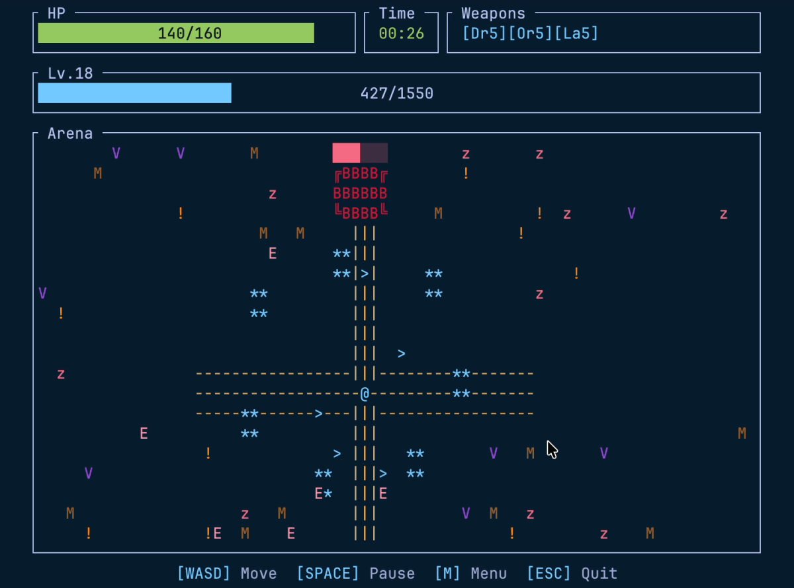

# Term Survivors

> **Note:** This project is currently under development. Features and APIs may change without notice.

A Vampire Survivors-like roguelike shooter that runs in the terminal.

Survive waves of enemies for 5+ minutes and defeat the final boss to clear the game. Weapons fire automatically.

Start quickly, pause anytime, and resume right where you left off — perfect for short breaks between AI-assisted work sessions.

<div align="center"></div>

Platforms: macOS / Linux / Windows

## Play

```bash
npx term-survivors
```

Or install permanently:

```bash
# npm
npm install -g term-survivors

# cargo
cargo install term-survivors

# Homebrew
brew tap kimulaco/term-survivors
brew install term-survivors
```

Then run:

```bash
term-survivors
```

```bash
term-survivors --help
term-survivors 0.3.0

USAGE:
    term-survivors [COMMAND]

OPTIONS:
    -h, --help       Print help information
    -V, --version    Print version information

COMMANDS:
    start    Start the game [default]
    clear    Delete save data (~/.term_survivors)
```

## Controls

Keyboard only. Mouse is not supported.

### In Game

| Key | Action |
|-----|--------|
| `W` `A` `S` `D` / Arrow keys | Move |
| `Space` | Pause / resume |
| `1` `2` `3` | Choose upgrade on level up |
| `M` | Return to title |

### Menus & Screens

| Key | Action |
|-----|--------|
| `Enter` | Start game / resume saved session (title screen) |
| `N` | Start new game (title screen) |
| `A` | Toggle auto restart (title screen) |
| `B` | Toggle dark mode (title screen) |
| `R` | Retry after game over / clear |
| `Q` / `ESC` | Quit |

## Save Data

Save data is stored in `~/.term_survivors/`:

To delete all save data:

```bash
term-survivors clear
```

## Logs

Each session writes debug logs to `~/.term_survivors/logs/latest.log` (overwritten on startup). The log records key events such as game start, level-up choices, and game over/clear outcomes, as well as any errors encountered during the session.

If you're reporting a bug, please include the contents of this file in your [issue](https://github.com/kimulaco/term-survivors/issues) — it helps narrow down what happened.

## Development

For contributors: see [docs/DEVELOPMENT.md](docs/DEVELOPMENT.md)

## License

[MIT](./LICENSE)
